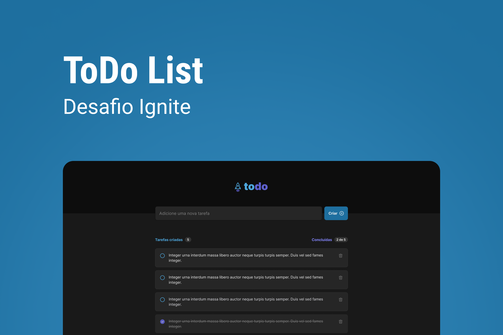

<p align="center"> 
   
</p>

<p align="center" style="margin-top: 18px> 


</p>


# Sobre o desafio

Nesse desafio, você vai desenvolver uma aplicação de controle de tarefas no estilo **to-do list**, que contém as seguintes funcionalidades:

- Adicionar uma nova tarefa
- Marcar e desmarcar uma tarefa como concluída
- Remover uma tarefa da listagem
- Mostrar o progresso de conclusão das tarefas

# Rodando o projeto

Faça o clone do projeto
```bash
$ git clone git@github.com:LucasMedeiros7/todolist-ignite-reactjs.git
```
Entre na pasta do projeto
```bash
$ cd todolist-ignite-reactjs
```
Instale as dependências
```bash
$ npm install 
# ou
$ yarn
```
Rode o servidor
```bash
$ npm run dev
# ou
$ yarn dev
```
